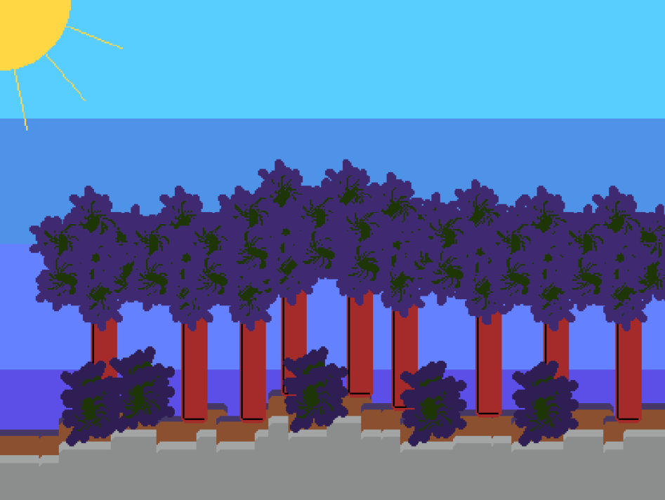
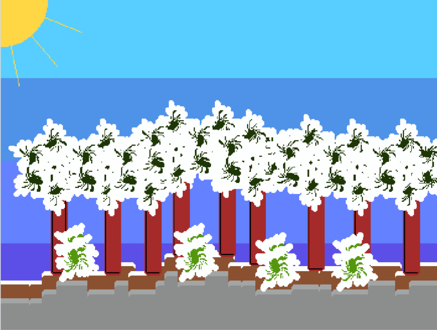
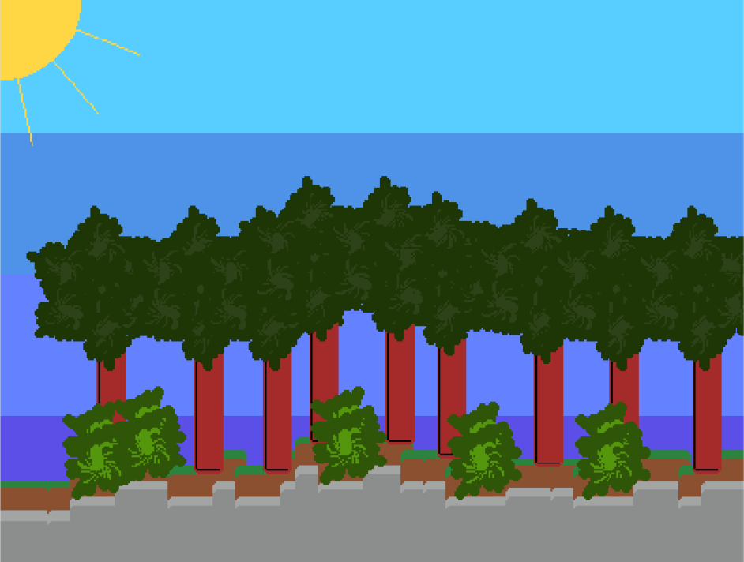
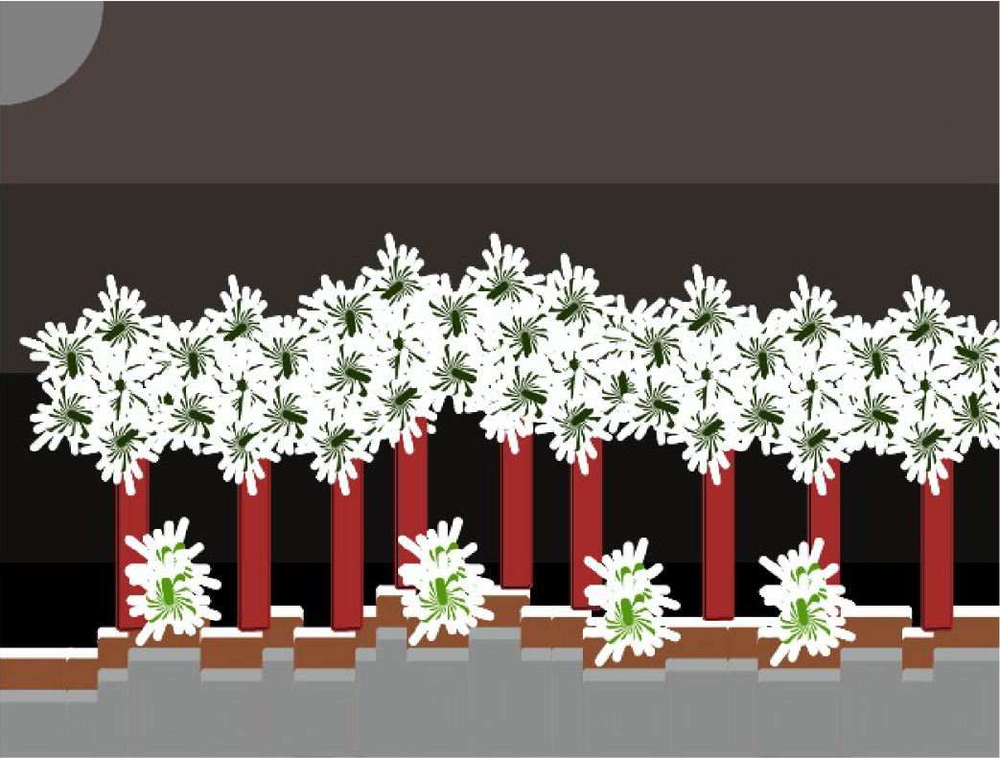

# turtle-graphics-random-generator

Generation of random drawing using turtle graphics in R.
From a phrase seed given in argument, it generates a pictures inspired by the game Terraria.

There is differents biome and multiple daytime determined randomly.

# Exemples

